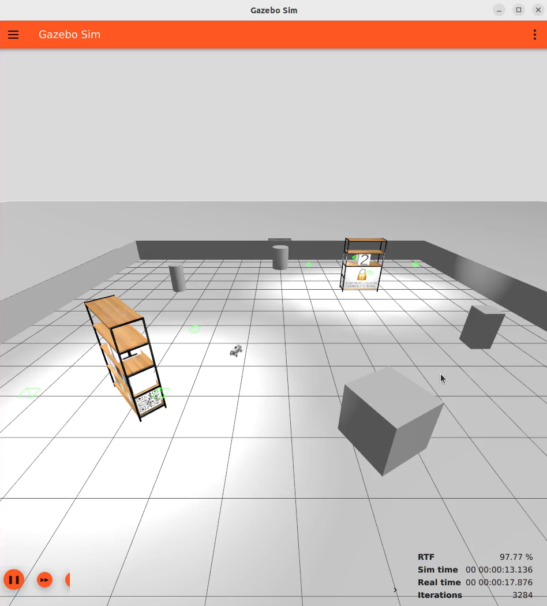
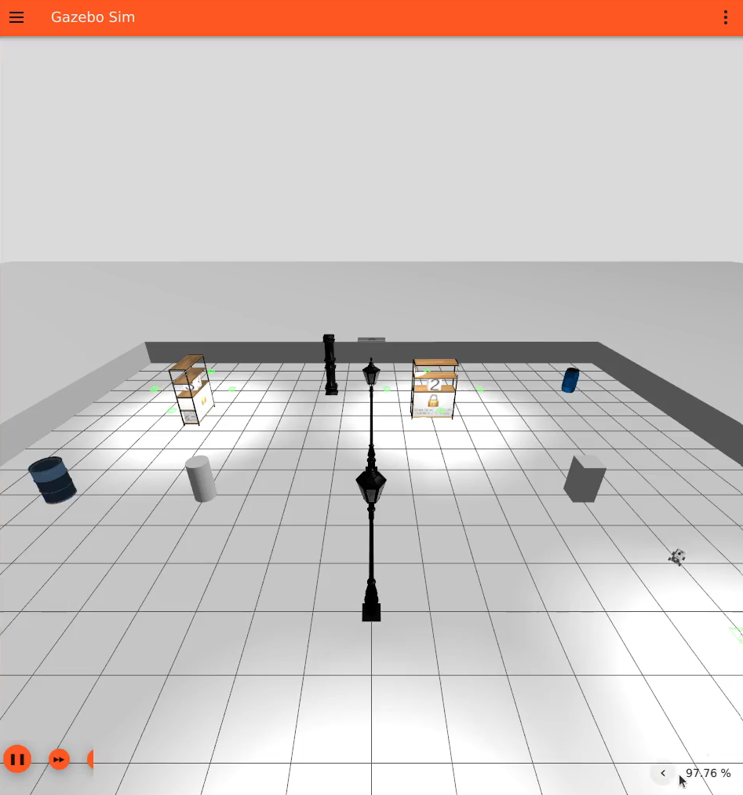
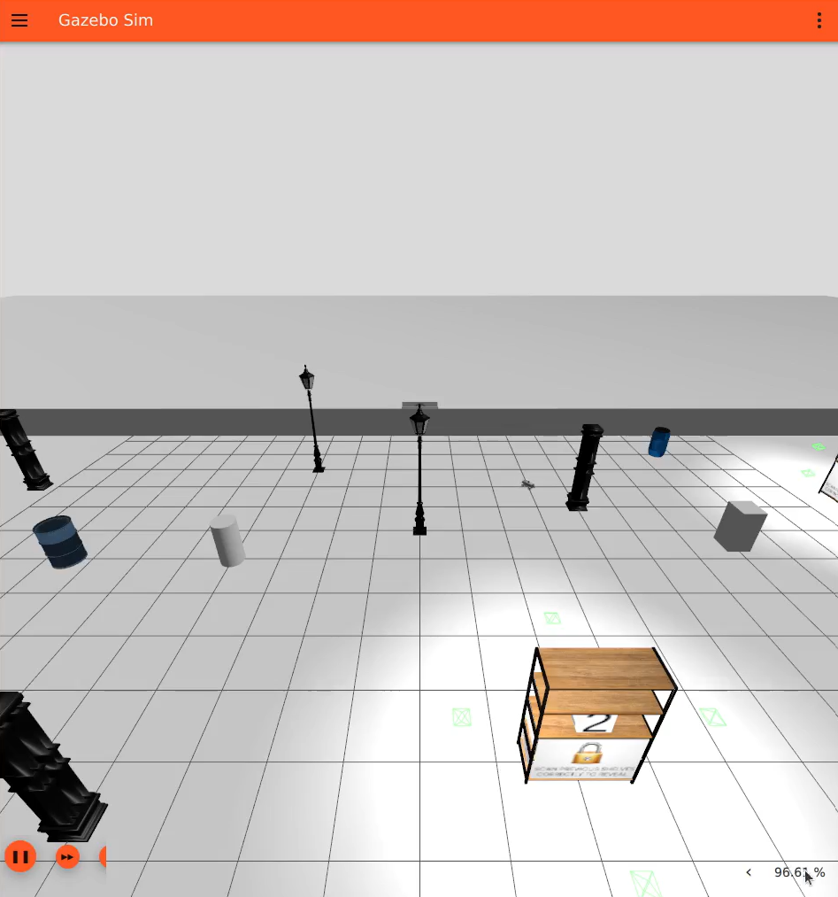
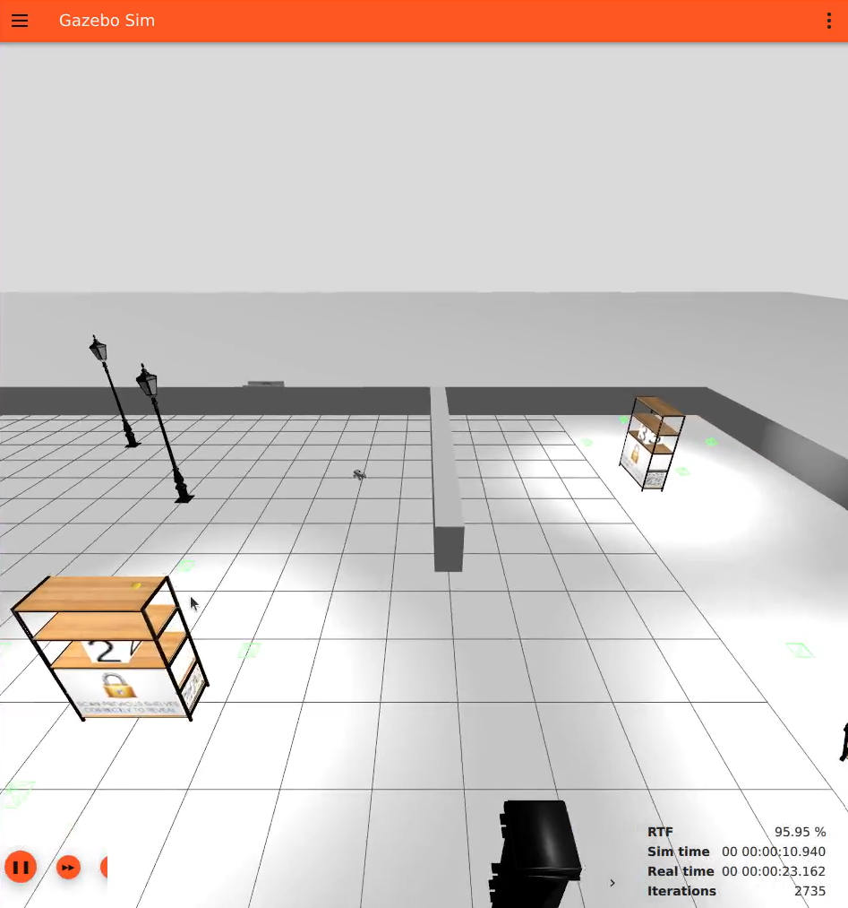
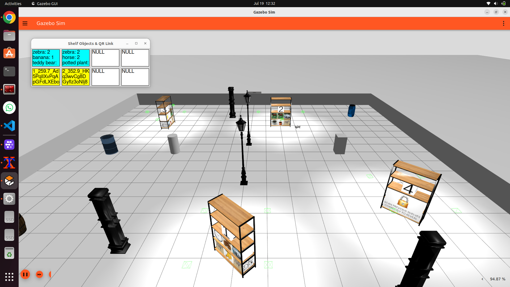

# 🏆 NXP AIM 2025 Warehouse Challenge

> **Team:** IntelliCruise  
> **Achievement:** 🏆 *First Prize – NXP AIM 2025 Autonomous Robotics Challenge*
> 

# Repository Structure


```text

NXP-AIM-25-demonstration
├── README.md
├── assets
│   ├── warehouse_1.mp4
│   ├── warehouse_2.mp4
│   ├── warehouse_3.mp4
│   ├── warehouse_4.mp4
│   └── images
│       ├── gazebo.png
│       ├── foxglove.png
│       └── simulation.png
└── docs
    └── competition_problem_statement.pdf
```


This repository showcases our solution demonstration developed for the **NXP AIM 2025 Warehouse Treasure Hunt & Object Recognition Challenge**, where our team secured **First Place**.


# Challenge Overview
The NXP AIM 2025 Warehouse Challenge required participants to develop a fully autonomous robotic system capable of operating in an unknown warehouse environment.
The primary objective was to maximize the evaluation score by autonomously exploring the environment, locating shelves, decoding QR codes, identifying shelf objects, and completing the task efficiently while minimizing errors and collisions.


# Problem Statement
Participants were required to develop a robotic system capable of:

* Autonomous navigation within an unknown warehouse environment.
* Generating and utilizing SLAM maps for localization and exploration.
* Detecting and locating warehouse shelves.
* Navigating to target shelves while avoiding obstacles.
* Decoding QR codes placed on shelves.
* Utilizing decoded heuristic information to locate subsequent shelves.
* Performing object recognition on shelf contents.
* Publishing identified objects and shelf information for evaluation.
* Optimizing task completion time, object detection accuracy, and navigation performance.


# Challenge Workflow
The autonomous system was required to perform the following sequence of operations:

1. Locate the first shelf using map-based or vision-based methods.
2. Navigate autonomously to the target shelf.
3. Detect and decode the QR code present on the shelf.
4. Extract heuristic information from the decoded QR data.
5. Position the robot for object recognition.
6. Detect and classify the objects present on the shelf.
7. Publish the shelf information for evaluation.
8. Utilize the heuristic information to locate the next shelf.
9. Repeat the process until all shelves are explored.


# Competition Environment
The challenge environment consisted of:

* Multiple warehouse shelves
* Dynamic exploration of unknown environments
* Obstacle avoidance
* Hidden shelves revealed sequentially
* QR-code-based treasure hunt mechanism
* Object recognition and classification tasks


The solution was developed and tested using:

* ROS 2 Humble
* Nav2
* SLAM Toolbox
* Gazebo Simulator
* Foxglove
* YOLO-based Object Recognition
* Python

# Demonstration Videos

<table>
<tr>
<td align="center">
<b>Warehouse 1</b><br>
<a href="assets/demo_vids/Warehouse_1.mp4">

</a>
</td>

<td align="center">
<b>Warehouse 2</b><br>
<a href="assets/demo_vids/Warehouse_2.mp4">

</a>
</td>
</tr>

<tr>
<td align="center">
<b>Warehouse 3</b><br>
<a href="assets/demo_vids/Warehouse_3.mp4">

</a>
</td>

<td align="center">
<b>Warehouse 4</b><br>
<a href="assets/demo_vids/Warehouse_4.mp4">

</a>
</td>
</tr>
</table>


# Simulation Environment

<table> <tr> <td align="center"> <b>Gazebo Simulation</b><br>  </td>

<td align="center"> <b>Foxglove Visualization</b><br>  </td> </tr> </table>
